On the Client: The client continuously receives state updates from the server. The ClientEntityManager on each client handles applying these:

```mermaid
flowchart TD
    A["(Client)EntityManager.**Update**"] --> X

subgraph LogicUpdate
    X[LocalSingleton.**VisualUpdate**] --> X1

    X1[LocalSingleton.**Update**] --> B2 
    B2["Apply **input** (set HumanControllerLogic.**CurrentInput**)"] --> C2
    C2[**Update** owned, local and UpdateOnClient entities] --> D2
    D2[Execute **RPC**s for this frame] --> B4

    B4[Execute **OnLateConstructed**] --> E4
    E4[Execute **BindOnSync** binded actions] --> F4
    F4["Write local lag compensation history (used for rollback)"] --> B
end
    B[Send **input**] --> C
    C{Check need to apply new server state}
    C -->|YES| A1
    C -->|NO| D

subgraph GoToNextState
    A1["**Destroy** spawned predicted local entities (they should be replaced by applied server state)"] --> B1
    B1[Set **ServerTick** to applied tick] --> B1_1
    B1_1[Set SyncVars from new state] --> C1
    C1[Execute **RPC**s for applied tick] --> D1
    D1[Execute **OnLateConstructed**] --> E1
    E1[Execute **BindOnSync** binded actions] --> F1
    F1["Write local lag compensation history (used for rollback)"] --> H1
end

subgraph Rollback
    H1["Call **OnBeforeRollback** for rollbacked entities"] --> J1
    J1[Reset SyncVar values to acknowledged state] --> K1
    K1["Execute **OnRollback** for entities and SyncableFields"] --> L1
    subgraph UpdateMode.PredictionRollback
         L1["For each stored, not acknoweldged input set **CurrentInput** and execute **Update**"]
    end
end
    L1 --> D
    D["Execute **VisualUpdate** for owned, local and **UpdateOnClient** entities"]
```

* Interpolation: For remote entities (ones the client is not controlling), LES uses an interpolation buffer to smooth out movement. Each update from the server comes with a tick timestamp, the client buffers a small amount of state and renders entities a bit behind the latest tick to interpolate between received positions. This results in smooth motion instead of jittery, frame-by-frame updates.

* Prediction & Reconciliation: For the local player’s own entity, the client may have predicted ahead. When the server’s update for that entity arrives, LES will reconcile any differences. If the server’s authoritative state differs from the client’s predicted state (e.g. due to unaccounted physics or corrections), the client will adjust.